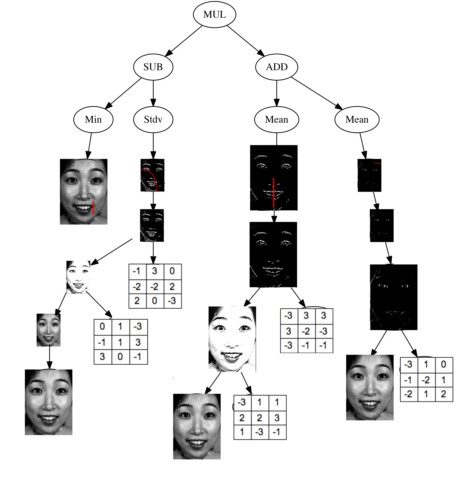
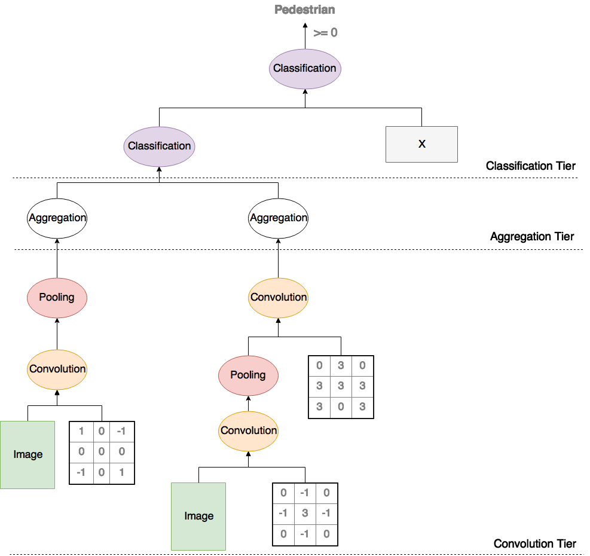

# ConvGP

This was my project as part of the requirements for my Honours degree in Computer Science at Victoria University of Wellington. A novel method for Binary image classification.

The key idea is to combine aspects from genetic programming and convolutional neural networks
to overcome various limitations of ConvNets, i.e.

- Need for manually crafted architectures
- Poor Interpretability. Although google brain appears to be doing some promising research in this area [here](https://distill.pub/2017/feature-visualization/), however a large limitation is still interpretability of feature interaction 
- Require large amounts of training data

An example of an evolved architecture is shown below

A breakdown of the archotecture is given below, a structure is enforced using strongly typed genetic programming.

Future work will look at propagting gradients back through the tree, as seen with Convoultional neural networks
as gradient descent still appears to be the most promising approach to filter/kernel weights learning.
